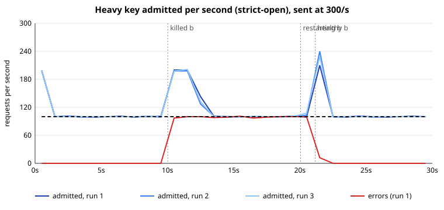
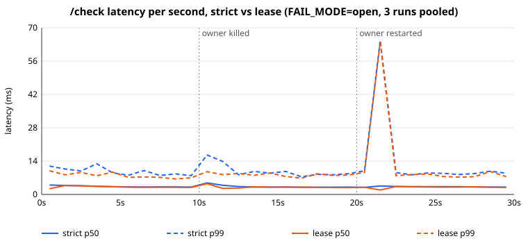

# Distributed Rate Limiter

A rate limiter that runs as a cluster of Node.js processes and enforces one
shared limit per key across the whole cluster, e.g. 100 requests per second
per user no matter which instance a request lands on. There is no Redis and no
database: each key is owned by exactly one instance, chosen by a consistent
hash ring, and every other instance asks that owner. Built from scratch in
strict TypeScript on Node's `http` module (no framework, tested with Vitest)
to see where a distributed limit actually leaks.

## What it does

- Enforces a cluster-wide token bucket per key across three instances
- Runs in **strict** mode (the owner makes every decision, exact) or **lease** mode (the owner hands out small batches of tokens that other instances spend locally)
- Removes dead instances from the ring via health checks, and lets them rejoin when they recover
- Includes a fixed-rate load generator and a fault-injection script that kills an owner mid-run

## How it works

```
client ── POST /check ──▶ instance A
                            │ getOwner(key) on the hash ring
                            ├─ A owns it ─▶ decide locally (token bucket)
                            └─ B owns it ─▶ strict: POST /internal/check to B
                                            lease:  spend a local lease, or
                                                    POST /internal/lease to B
```

| Endpoint | Caller | Behaviour |
|---|---|---|
| `POST /check` `{key, cost?}` | clients | Always HTTP 200 with `{allowed, remaining, retryAfterMs}`. Forwards to the owner if needed. |
| `POST /internal/check` | peers | Always decides locally and never forwards. |
| `POST /internal/lease` | peers (lease mode) | Grants `min(lease size, whole tokens left)` from the owner's bucket, plus a duration. |
| `GET /health` | peers | Liveness for the health checker. |

## Architecture decisions

**Token bucket with lazy refill**

Each bucket stores only `tokens` and `lastRefillMs`. Tokens are recomputed
from elapsed time on every call, so there is no timer per key. Capacity (burst
size) and refill rate are separate settings: with 100 and 100/s, a quiet
client can burst 100 at once and then settles at 100/s. The clock is injected
and monotonic (`performance.now()`), so tests run on a fake clock and a
wall-clock jump can't refill or drain a bucket.

**One owner per key instead of shared state**

The alternative was a shared store (Redis) or syncing counters between
instances. With a single owner per key there is nothing to sync, and the limit
is exact in strict mode. The cost: an owner's buckets die with it, and one hot
key lands on one instance.

**Consistent hashing over `hash % N`**

When an instance leaves, only its own keys should move, because every moved
key gets a fresh bucket (and therefore a fresh burst). Measured over 100,000
keys with this ring (100 virtual nodes per instance):

| Change | Ring | `hash % N` |
|---|---|---|
| Remove 1 of 3 instances | 33.0% of keys move | 66.5% move |
| Add a 4th instance | 27.1% move | 74.8% move |

**Static peer list, no gossip**

Peers come from the `PEERS` env var. Health checks decide who is in the ring,
but no membership protocol is involved. A gossip layer would be most of the
project on its own.

## Engineering notes

**Forwarding loops are impossible by construction**

Only `/check` ever forwards. `/internal/check` and `/internal/lease` always
answer locally, so even if two instances briefly disagree about who owns a
key, a request crosses the network at most once.

**Every forward has a timeout**

A forward or lease request that takes longer than `FORWARD_TIMEOUT_MS` (50 ms
by default) counts as "owner unreachable" and follows `FAIL_MODE=open|closed`.
Without it, one slow instance would make every instance slow.

**Leases are partial and deduplicated**

The owner grants whatever whole tokens it has, up to the lease size, rather
than all or nothing. All-or-nothing starved non-owners, because the owner's own
traffic kept its bucket below a full lease. Only one lease request per key is
in flight on an instance, and the next lease is prefetched when 20% of the
current one is left, so requests rarely stall.

**Membership rejoin**

A peer is removed after 3 missed checks (every 500 ms, so about 1.5 s) and
rejoins on its first successful check. Without rejoin, one instance seeing a
brief blip would keep a different ring from the others forever.

## Results

Setup: 3 instances on one Windows machine, limit 100/s (capacity 100). One
heavy key is sent at a fixed **300/s** and five light keys at 10/s, spread
round-robin across all three instances. The heavy key's owner is killed at
10 s and restarted at 20 s. Each scenario ran 3 times; ranges are min to max.
Raw data is in [bench/results/](bench/results/).

Heavy key, admitted per second:

| Phase | strict-open | strict-closed | lease-open | lease-closed |
|---|---|---|---|---|
| 0-10 s, healthy | 109.9-110.0 | 109.9 | 109.9 | 109.9 |
| 10-20 s, owner dead | 122.3-124.5 | 97.2-98.4 | 121.4-123.5 | 96.7-98.5 |
| 20-30 s, after restart | 110.9-114.2 | 112.5-115.6 | 112.4-114.5 | 108.3-114.0 |

`/check` latency over the whole run, all keys:

| | p50 | p99 |
|---|---|---|
| strict | 3.29-3.40 ms | 9.90-12.33 ms |
| lease | 3.06-3.19 ms | 8.26-10.05 ms |




**What the numbers say**

- **The limit holds.** 110/s in the healthy phase is not leakage: it is the
  100-token starting burst plus 100/s × 10 s. The busiest single second is 199,
  a full bucket plus one second of refill, which is exactly what capacity 100
  allows.
- **Failover is where the limit leaks.** For about 1.5 s the survivors still
  route the heavy key to the dead owner: fail-open admits everything in that
  window (about 122/s over the phase), fail-closed admits nothing (about 97/s)
  and also blocks light keys owned by the dead instance (97.3-99.4% allowed).
  Then the new owner starts with a full bucket, and on restart the key moves
  back to yet another full bucket. Peak seconds after restart reach 174-247,
  most likely including a brief window where instances disagree about the
  owner.
- **Lease mode's latency win is small here, and it showed no over-admit.** p50
  improves by about 0.25 ms and p99 by about 2 ms, because on localhost the
  extra hop is nearly free. Healthy-phase admits are identical in strict and
  lease (1099-1100): leased tokens come out of the owner's bucket, so
  over-admit can only appear in short windows or on failover, and this
  workload didn't surface it.
- **About 1,160 errors per run are client-side.** The load generator doesn't
  skip the dead instance, so the requests sent straight to it fail to connect
  while it is down.

## Limitations

- Lease parameters weren't swept: only the defaults (10% of capacity, 1 s,
  prefetch at 20%) were measured.
- Everything runs on one machine, so latency shows relative cost, not real
  network cost.
- A hot key still loads one owner in strict mode; lease mode only reduces it.
- One global rule for every key, a static peer list, no replication, no auth.

## What I learned

**A distributed limit is only as exact as ownership is stable**

In steady state the limit is exact. Everything that went over 100/s traced
back to a bucket being recreated: at startup, on failover, on rejoin. Keeping
key movement small (the ring) matters more than making the bucket clever.

**Read the number before calling it a bug**

110/s against a 100/s limit looked like a leak until the burst was accounted
for. Each surprising result here had a mechanical explanation, and writing
that explanation down was the useful part of benchmarking.

## Running it

Prerequisites: Node.js 20+.

```
npm install
npm run cluster          # 3 instances on ports 3001-3003
curl -X POST localhost:3001/check -H "content-type: application/json" -d "{\"key\":\"user-1\"}"

npm test                 # unit + cluster tests
npm run bench            # all fault scenarios, about 7 minutes
npm run plot             # graphs and summary.csv from the results
```

Main settings (env vars; `npm run cluster` sets the required ones, the rest
are in [src/node/config.ts](src/node/config.ts)):

| Variable | Default | Description |
|---|---|---|
| `PEERS` | required | Static list, e.g. `a=localhost:3001,b=localhost:3002` |
| `MODE` | `strict` | `strict` or `lease` |
| `FAIL_MODE` | required | `open` or `closed` when the owner is unreachable |
| `CAPACITY` / `REFILL_PER_SEC` | `100` / `100` | Bucket size and refill rate |
| `FORWARD_TIMEOUT_MS` | `50` | Timeout for forwards, leases and health checks |

## Project structure

```
src/
  limiter/tokenBucket.ts   # token bucket, Limiter interface, lease grants
  ring/hashRing.ts         # consistent hash ring, getOwner(key)
  node/server.ts           # HTTP endpoints, forwarding, lease-mode checks
  node/leases.ts           # lease holder: spend, expiry, prefetch
  node/peers.ts            # health checks and ring membership
  node/config.ts           # env parsing
  cluster/launch.ts        # starts three local instances
bench/
  loadgen.ts               # fixed-rate client with keep-alive
  faults.ts                # kill and restart the owner mid-run
  plot.ts                  # SVG graphs and summary.csv
  results/                 # raw CSVs, graphs, summary
test/                      # tokenBucket, hashRing, leases, peers, cluster, plot
```
